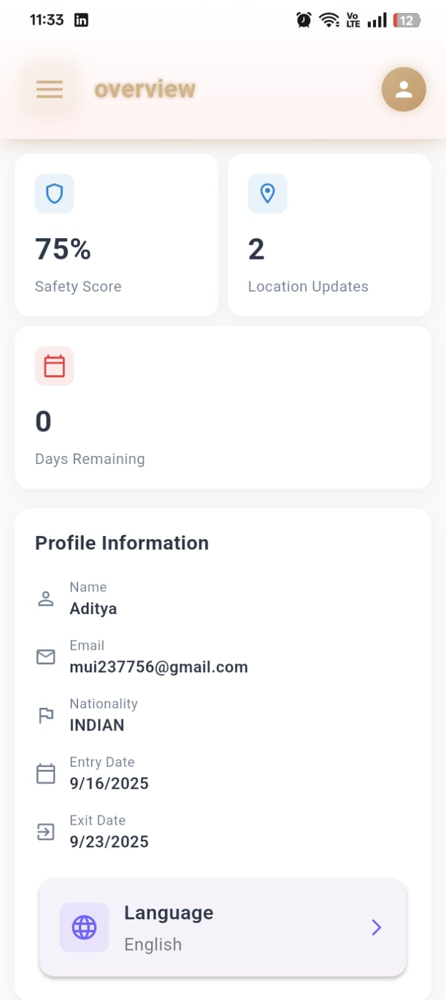
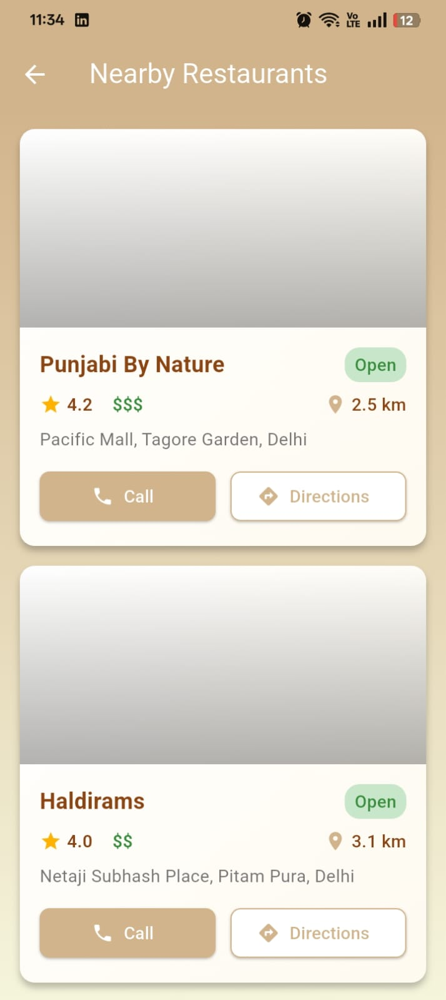
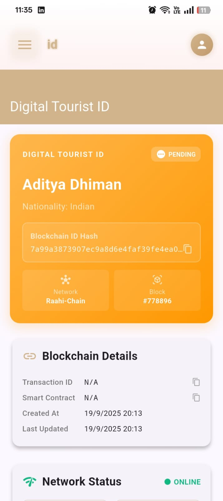
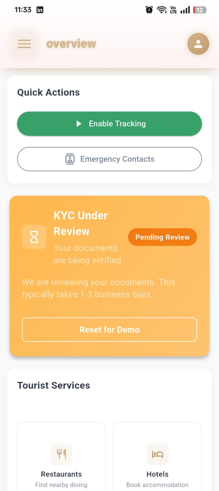
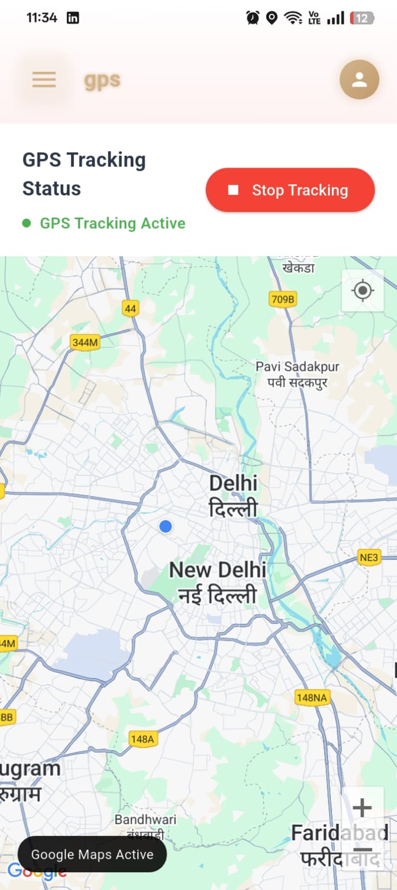
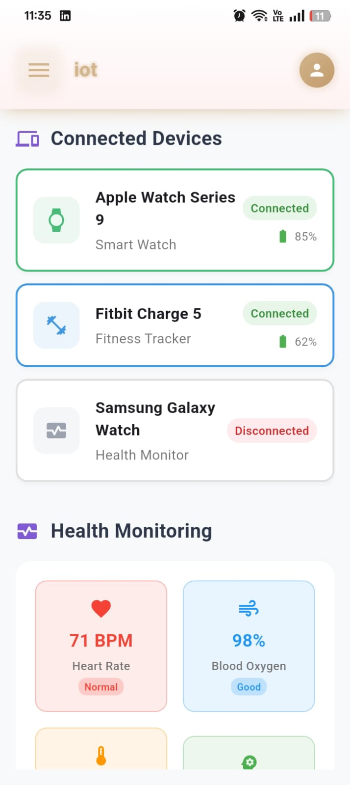
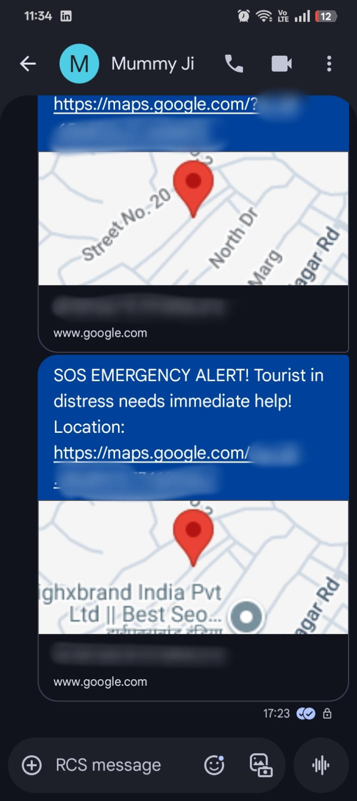

<div align="center">

# 🛡️ Raahi - Smart Tourist Safety System


*Your intelligent travel companion for safe and secure tourism*

**🏆 Developed for Smart India Hackathon (SIH) 2025 Problem Statement**

[](https://flutter.dev)
[](#)
[](https://sih.gov.in)
[](#)

</div>

## 📱 App Screenshots

<div align="center">
  
  
  
  
</div>

<div align="center">
  
  
  
  
</div>

<div align="center">
  
  
</div>

## 🌟 Features

### 🔐 **Authentication & Security**
- Secure user authentication with Supabase
- Digital ID management and KYC updates
- Blockchain-based security features
- Multi-language support (English/Hindi)

### 🗺️ **Location & Navigation**
- Real-time GPS tracking and location services
- Google Maps integration with live directions
- Nearby places discovery (Restaurants, Hotels, Medical, Transport)
- Geofencing with custom safety zones
- Smart location-based alerts

### 🚨 **Emergency Features**
- One-tap emergency alert system
- Emergency contacts management
- Real-time health monitoring
- AI-powered anomaly detection
- Automatic safety score calculation

### 🏨 **Travel Assistance**
- Google Places API integration for real business data
- Live ratings, photos, and business information
- Multi-app navigation support
- Price level indicators and opening hours

### 🤖 **AI-Powered Features**
- Intelligent chatbot integration (Chatbase)
- Behavior tracking and analysis
- Predictive safety alerts
- Smart recommendations

### 🔊 **Alerts & Notifications**
- Audio alerts with custom sound effects
- Push notifications for safety updates
- Multi-channel emergency communication

## 🛠️ Tech Stack

- **Frontend**: Flutter 3.8.1+
- **Backend**: Supabase (PostgreSQL, Authentication, Real-time)
- **Maps**: Google Maps API, Google Places API
- **Location**: Geolocator, Location Services
- **Audio**: AudioPlayers for emergency sounds
- **State Management**: Provider
- **Image Handling**: Image Picker
- **Web Integration**: WebView Flutter
- **Local Storage**: Shared Preferences, SQLite

## 📋 Prerequisites

- Flutter SDK 3.8.1 or higher
- Dart SDK
- Android Studio / VS Code
- Google Maps API Key
- Google Places API Key
- Supabase Project Setup

## 🚀 Getting Started

### 1. Clone the Repository
```bash
git clone https://github.com/Aditya-Dman/Raahi.git
cd Raahi
```

### 2. Install Dependencies
```bash
flutter pub get
```

### 3. API Configuration

#### API Configuration
This app integrates with Google Maps API and Supabase for backend services. Configuration files are located in:
- `lib/services/places_service.dart` - Google Places API
- `lib/services/supabase_config.dart` - Supabase configuration

### 4. Database Setup
Run the SQL scripts in the Supabase SQL editor:
- `supabase_emergency_contacts_table.sql`
- `create_table_function.sql`
- `docs/digital_ids_table.sql`

### 5. Run the App
```bash
flutter run
```

## 📁 Project Structure

```
lib/
├── main.dart                     # App entry point
├── splash_screen.dart           # Loading screen
├── login_page.dart              # Authentication
├── signup_page.dart             # User registration
├── dashboard_page.dart          # Main dashboard
├── digital_id_screen.dart       # Digital ID management
├── emergency_contacts_screen.dart # Emergency contacts
├── places_list_screen.dart      # Nearby places
├── geofencing_settings_screen.dart # Location settings
├── kyc_update_screen.dart       # KYC updates
├── models/                      # Data models
│   └── emergency_contact.dart
├── services/                    # Business logic
│   ├── supabase_*.dart         # Database services
│   ├── emergency_alert_service.dart
│   ├── places_service.dart
│   ├── ai_*.dart               # AI features
│   └── ...
├── widgets/                     # Reusable components
└── l10n/                       # Localization files
```

## 🔧 Configuration Files

- `SUPABASE_SETUP.md` - Database setup guide
- `PLACES_INTEGRATION_GUIDE.md` - Google Places API guide  
- `CHATBASE_INTEGRATION.md` - AI chatbot setup
- `REAL_DATA_SETUP.md` - Real data configuration

## 🌍 Supported Platforms

- ✅ Android
- ✅ iOS  
- ✅ Web
- ✅ Windows
- ✅ macOS
- ✅ Linux

## 📱 Key Screens

1. **Splash Screen** - App loading with branding
2. **Authentication** - Login/Signup with Supabase
3. **Dashboard** - Main hub with all features
4. **Emergency Contacts** - Manage emergency contacts
5. **Nearby Places** - Discover local businesses
6. **Digital ID** - Identity management
7. **Geofencing** - Location-based safety zones

## 🔒 Security Features

- End-to-end encrypted communications
- Secure authentication with Supabase
- Local data encryption
- Privacy-focused location tracking
- Blockchain integration for enhanced security

## 🏆 About SIH 2025

This project was developed as a solution for **Smart India Hackathon 2025**, addressing the critical need for tourist safety and security in India. The app provides comprehensive safety features for tourists, including emergency alerts, real-time tracking, and AI-powered assistance to ensure safe and secure tourism experiences.

## 📄 License

This project is licensed under the MIT License - see the [LICENSE](LICENSE) file for details.

## 👨‍💻 Developer

**Aditya Dman**
- GitHub: [@Aditya-Dman](https://github.com/Aditya-Dman)

## 🙏 Acknowledgments

- Smart India Hackathon 2025 for the opportunity
- Flutter team for the amazing framework
- Supabase for backend infrastructure
- Google for Maps and Places APIs

## 📞 Support

If you found this project helpful, please give it a ⭐️!

---

<div align="center">
  <strong>Built with ❤️ using Flutter for SIH 2025</strong>
</div>
